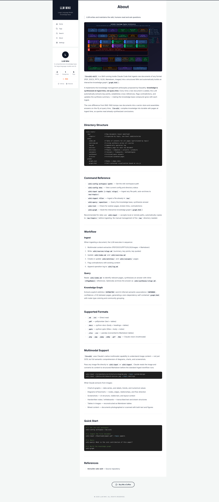
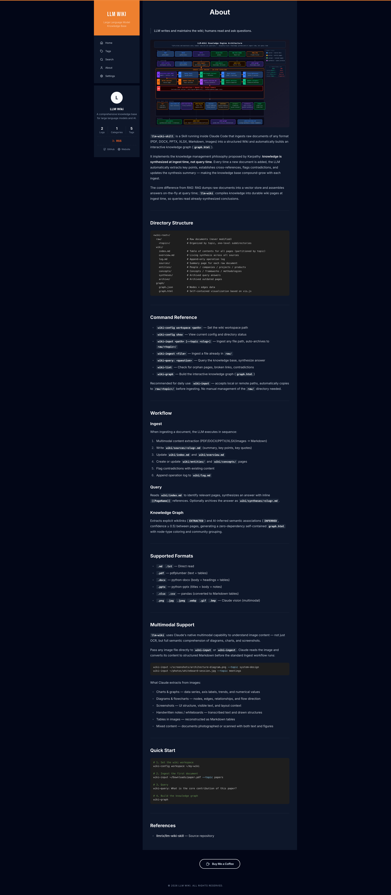

# LLM Wiki

A clean, zero-backend wiki for large language model knowledge. Drop Markdown files in, get a fully-featured knowledge site out — no database, no CMS, no server required.

| Light | Dark |
|-------|------|
|  |  |

---

## Highlights

### Zero-backend, file-driven content
Articles are plain `.md` files with YAML frontmatter. Add a file to `src/public/`, and it appears on the site automatically at the next build. No API calls, no database migrations, no deployment pipeline changes.

### Rich Markdown rendering
The renderer goes well beyond standard Markdown:
- **LaTeX math** — inline `$...$` and block `$$...$$` via KaTeX
- **Mermaid diagrams** — flowcharts, sequence diagrams, ER diagrams rendered in-browser
- **Syntax highlighting** — 100+ languages with VS Code Dark+ theme via Prism
- **GFM** — tables, strikethrough, task lists, autolinks
- **Raw HTML** — embed custom HTML blocks directly in articles
- **Lucide icons** — use `<icon name="..." />` tags inline in Markdown content

### Full-text client-side search
Instant search across article titles, summaries, body content, categories, and tags — all in the browser, no search index or backend needed.

### Category & tag system
Every article belongs to a category and can carry multiple tags. The sidebar shows live counts for articles, categories, and tags. Dedicated `/categories` and `/tags` pages let readers browse by topic or keyword, with clickable tags that jump straight into search results.

### Built-in RSS feed
One click on the RSS button in the sidebar generates a valid RSS 2.0 feed from all articles, sorted by date, and opens it in a new tab — ready to paste into any feed reader.

### Social sharing on every post
Each article footer includes one-click share buttons for Twitter, Facebook, WhatsApp, and Telegram, plus a copy-link button with visual confirmation.

### SEO out of the box
Every page sets `<title>`, `<meta description>`, Open Graph tags, and a `<link rel="canonical">` automatically based on the current route and article metadata. Article pages also emit `application/ld+json` structured data for search engines.

### Multilingual UI
The entire interface is localized in five languages — Simplified Chinese, Traditional Chinese, English, Japanese, and Korean — with automatic browser language detection via i18next.

### Light / Dark theme
Toggle between themes from the Settings page. The preference is persisted across sessions.

### Smooth page transitions
Route changes and list renders are animated with Framer Motion for a polished feel without any extra configuration.

### Fully responsive
The sidebar collapses gracefully on mobile. Content is readable on any screen size.

---

## Stack

| Layer | Library |
|-------|---------|
| Framework | React 19 + Vite 6 |
| Styling | Tailwind CSS 4 + @tailwindcss/typography |
| Routing | React Router 7 |
| Markdown | react-markdown, remark-gfm, remark-math, rehype-katex, rehype-raw |
| Diagrams | Mermaid.js |
| Code highlighting | react-syntax-highlighter (Prism) |
| Math | KaTeX |
| i18n | i18next + i18next-browser-languagedetector |
| Animation | Framer Motion (motion/react) |
| Icons | Lucide React |

---

## Getting Started

```bash
npm install
npm run dev       # http://localhost:3000
npm run build     # output to dist/
npm run preview   # preview production build
```

---

## Adding Articles

Place a `.md` file in `src/public/` with frontmatter:

```markdown
---
title: "Transformer Architecture"
category: Architecture
date: 2026-04-15 00:00:00
tags: [Transformer, Attention, LLM]
summary: "A deep dive into the Transformer architecture and self-attention mechanism."
---

Your article content here. Supports **GFM**, $LaTeX$, mermaid diagrams, and syntax highlighting.

```python
def scaled_dot_product_attention(Q, K, V):
    scores = Q @ K.T / math.sqrt(K.shape[-1])
    return softmax(scores) @ V
```
```

The About page is driven by `src/source/about.md` and supports the same full Markdown feature set.

---

## Configuration

Edit `src/config.json` to customize the site:

```json
{
  "profile": {
    "name": "LLM Wiki",
    "bio": "A comprehensive knowledge base for large language models and AI.",
    "buyMeCoffeeUrl": "https://www.buymeacoffee.com/yourname"
  },
  "site": {
    "title": "LLM Wiki",
    "subtitle": "Large Language Model Knowledge Base"
  },
  "social": {
    "github": "https://github.com/yourusername",
    "twitter": "https://twitter.com/yourusername",
    "website": "https://yourwebsite.com"
  },
  "ui": {
    "postsPerPage": 10,
    "defaultTheme": "light"
  }
}
```

---

## License

MIT
